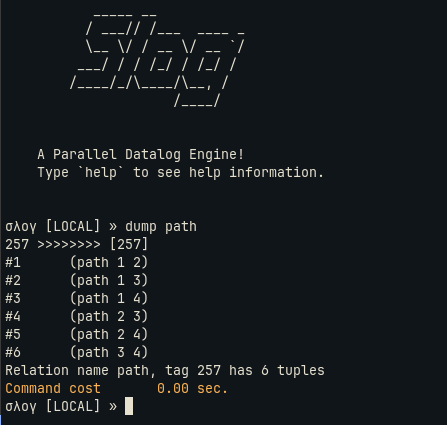

## A Simple Example : Transitive Closure

So, you are in the docker container with [slog set-up](./setup_slog.md) We will do `Transitive Closure` as the first example to introduce some of the basic functionality. 

TC in slog, looks like:
```slog
[(path x y) <-- (edge x y)]
[(path x y) <-- (edge x z) (path z y)]
```

A simple example with two rules. Here `path` and `edge` are two relations, `edge` is the Extensional Database or the input relation, and path is the output relation. Slog infers what is input and output from the rules. 

Each rule has a `head` and a `body`,  the arrow points from body to head, if body is true, head is inferred.

In the example, 
- The first rule says that, if relation edge has a tuple `(x y)` add the tuple to path relation.
- Second rule is a recursive rule, with path in both head and body, if there is an edge from x to z and there is a path from z to y, then add a path between x y.
- Second rule is the one that expands the paths by `1` hop for each iteration, reaching a fixed point when all the nodes are reached.

### Run TC
- Put the above program in `tc.slog` file.
- We need input for the program, facts for the `edge` relation, these facts can be directly stored in the program or can be picked from a tab separated file.
- For our example, we will use input folder option, that contains the edge facts file, Contents of the edge.csv file can be
```tsv
1	2
2	3
3	4
```
- Once slog executes, it needs a output folder to store the facts to.
- This is the structure of the dir we are using,
```tree
TC/
|-- input
|   `-- edge.csv
|-- output
`-- src
    `-- tc.slog

3 directories, 2 files
```
- For this example, slog can be run from the `/slog` using
```bash
./runslog -R --facts /TC/input/ /TC/src/tc.slog /TC/output/
```
- `./runslog -h` will tell you about all the options available, or jump to [REPL and runslog](./repl_and_runslog.md) for more details about runslog.
- Once the execution is done, You will be in the REPL, and can look at `path` relation by dumping it, run `dump path`.



For more of a tutorial, jump to [Tutorial](./tutorial.md). 
