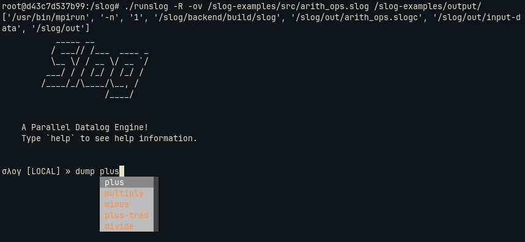
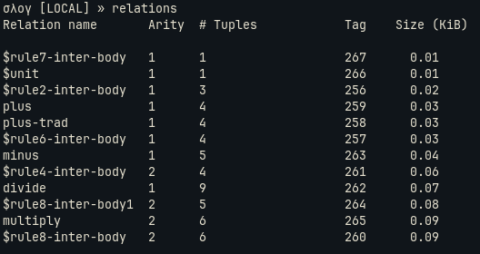

# ./runslog and REPL
runslog and REPL are the two main points of interaction for a user with Slog.

## ./runslog
- runslog is a python script that sits in the slog root, that let's the user run slog, and drop into the REPL and other flags to enable different functionalities.
- Running .`/runslog -h`, will show the options available and what each option means.
```text
./runslog
usage: runslog [OPTION] [slogfile] [out_dir]
-------------------------------------------------
Options:
-f <DIR>, --facts <DIR>
	Specify directory for fact files
-s SERVER, --server SERVER
	The location of server, if server mode is used
-j CORES, --cores CORES
	The number of cores to compute with
-v, --verbose
	Use verbose ouput
-r <DIR>, --root <DIR>
	The location of slog project directory, Defaults to the current working directory is not provided.
-d, --debug
	Running with valgrind in debug mode
-p, --profile
	compile with -pg in cmake for using gprof.
-cb, --compile_backend 
	compile the backend code before actual compilation to generate C++ code.
-R, --repl
	query the result databse interactively
-co, --compiler-only
	JIT compile without running
-ov, --overwrite_out 
	overwrite, if the output dir already exists
-lb, --local-db
	Use the already existing database folder
```
### Examples
```bash
./runslog -v -R -ov -j <cores> -f <in_dir_name>  <filename>.slog <out_dir_name>
```

```bash
./runslog -R <filename.slog> <out_dir_name>
```

## REPL
- The -R options puts you in the REPL to introspect on facts in the database.
- And it lets you do exactly that, just `dump <rel-name>`, it dumps the facts and you can look through them.

- `relations` lists all the relations in the database including the internal intermediate ones.

- In Slog, we cannot directly print to the terminal. Instead, we might consider building up an output relation, for example `print-out`, which we will populate with any output we want to see. A sample program might look like this:
```slog
; hello.slog
(welcome-msg 0 "hello-world")
(welcome-msg 1 "hello-moon")
(welcome-msg 2 "hello-earth")
(welcome-msg 3 "hello-sun")

[(print-out msg) <-- (print-welcome msg-id) (welcome-msg msg-id msg)]
(print-welcome 1)
```
- Here, This is similar to what we would want from a printf-style debugging, and can be useful in undestanding what each rule is doing in a program.
- Note, Here we are not using spaces in the strings, because the current parser does not support spaces in strings.
